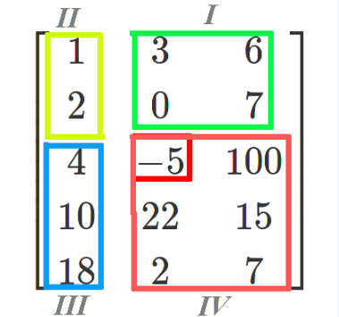

Еден елемент од матрица ја дели матрицата на 4 квадранти (прикажани на сликата). Притоа самиот елемент кој ја дели
матрицата припаѓа во четвртиот квадрант (-5 во примерот на сликата).

Од стандарден влез се внесува матрица со димензии NxM (1 <= N, M < 100). Потоа се внесуваат два броеви кои претставуваат
индекси на еден елемент од матрицата.

Да се најдат сумите на секој од квадрантите и да се испечатат на стандарен излез. Притоа се печати сумата за првиот
квадрант, па за вториот, па третиот и на крај за четвртиот. Доколку не може да се креира квадрант, тогаш за сумата на
тој квадрант треба да се испечати 0.



```C++
Влез:
2 3
5 7 8
1 2 3
1 1

Излез:
15 5 1 5
```