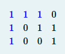

Да се напише програма која вчитува матрица со димензии MxN (макс. 100x100). На почетокот се внесуваат димензиите на
матрицата,
а потоа и елементите на матрицата кои се само вредностите 1 и 0. Програмата треба да изброи и отпечати на СИ во колку од
редиците и колоните има барем 3 последователни елементи со вредност 1. Ако има барем 3 последователни нека продолжи со
другите колони или редици.



```C++
Влез:
3 8
0 0 1 1 1 0 0 0
1 1 1 0 1 1 1 0
0 1 1 1 1 0 0 1
Излез:
5

Влез:
7 9
1 0 0 0 0 0 1 1 0
0 0 0 0 1 1 1 1 0
0 1 1 0 1 0 1 1 0
1 1 1 0 0 1 1 0 1
1 1 1 0 0 0 1 0 0
0 1 0 1 1 0 1 0 1
0 0 1 1 0 1 0 0 1
Излез:
7
```