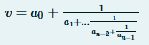

Да се имплементира рекурзивна функција која за низа од цели броеви `$[a{0}, a{1}, ..., a_{n-1}]$` ќе ја пресмета
вредноста на непрекинатата дропка дефинирана како:



Да се напише програма во која се чита цел број N, по што се читаат елементите на низа од N цели броеви (не повеќе од
100). Потоа се повикува рекурзивната функција и се печати резултатот во нов ред.

```C++
Влез:
50 50 8 43 32 29 4 23 26 17 16 30 16 20 42 41 24 36 27 38 43 22 10 27 14 48 21 20 40 36 13 10 28 33 3 8 3 6 49 23 23 12 31 37 33 12 47 32 42 16 1
Излез:
50.124638
```

```C++
Влез:
7 3 7 15 1 292 1 1
Излез:
3.141593
```